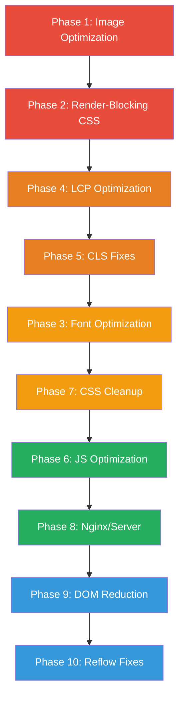

# Coffee Globe - Performance Optimization Plan
## تحسين أداء الموقع وفهرسة جوجل

---

## Executive Summary

Based on Google PageSpeed Insights analysis, the website `coffeeglobe.sa` has multiple performance issues affecting **LCP**, **FCP**, **CLS**, and overall page load speed. This plan addresses all identified issues across 10 phases with specific file-level changes.

### Current Issues Overview

| Issue | Impact | Estimated Savings |
|-------|--------|-------------------|
| Render-blocking resources | LCP, FCP | 1,340 ms |
| Unoptimized images | LCP, FCP | 972 KiB |
| Font rendering delay | FCP | 100 ms |
| Forced reflows | Performance | 70 ms |
| LCP image not discoverable | LCP | 1,570 ms element render delay |
| Critical request chains | LCP | 747 ms max response |
| Large DOM size | Performance | 350 elements |
| Unused JavaScript | LCP, FCP | 60.7 KiB |
| Unused CSS | LCP, FCP | 20.5 KiB |
| Missing image dimensions | CLS | Layout shifts |
| Large network payloads | Performance | 2,622 KiB total |

---

## Phase 1: Image Optimization - تحسين الصور
**Estimated savings: ~972 KiB**

### 1.1 Convert PNG Images to WebP Format

The following PNG images must be converted to WebP with fallbacks:

| Current File | Size | Target WebP | Est. Savings |
|-------------|------|-------------|--------------|
| `/images/slider.png` | 442.9 KiB | `/images/slider.webp` | ~431 KiB |
| `/images/mask_2.png` | 360.9 KiB | `/images/mask_2.webp` | ~272 KiB |
| `/images/layout_2.png` | 200.4 KiB | `/images/layout_2.webp` | ~149 KiB |
| `/images/layout.png` | 141.1 KiB | `/images/layout.webp` | ~100 KiB |
| `/images/mask.png` | 209.0 KiB | `/images/mask.webp` | ~150 KiB |
| `/images/service.png` | 127.4 KiB | `/images/service.webp` | ~118 KiB |
| `/images/card_bg.png` | - | `/images/card_bg.webp` | ~80 KiB |
| `/images/bg_slide.png` | - | `/images/bg_slide.webp` | ~60 KiB |
| `/images/logo.png` | - | `/images/logo.webp` | ~20 KiB |

**Implementation approach:**
- Use `<picture>` element with WebP source and PNG fallback
- Use sharp/squoosh CLI or online tools for conversion
- Target quality: 80% for photos, lossless for graphics

### 1.2 Create Responsive Image Variants

Images are served at much larger sizes than displayed. Create multiple sizes:

| Image | Current Size | Displayed Size | Needed Variants |
|-------|-------------|----------------|-----------------|
| `slider.png` | 540x416 | 300x231 | 300w, 540w |
| `layout_2.png` | 650x1421 | 380x831 | 380w, 650w |
| `logo.png` | - | 80-100px | 80w, 160w for retina |

**Example implementation in Vue:**
```html
<picture>
  <source srcset="/images/slider-300w.webp 300w, /images/slider-540w.webp 540w" 
          type="image/webp" sizes="100vw">
  <source srcset="/images/slider-300w.png 300w, /images/slider-540w.png 540w" 
          type="image/png" sizes="100vw">
  
</picture>
```

### 1.3 Optimize SVG Files

| File | Current Size | Issue |
|------|-------------|-------|
| `/images/CTA1.svg` | **823.5 KiB** | Extremely large for SVG - likely contains embedded raster data |
| `/images/CTA.svg` | - | Review for optimization |
| Other SVGs | - | Run through SVGO |

**Action:** Run `CTA1.svg` through SVGO optimizer. If it contains embedded bitmaps, convert those to external WebP references. This single file accounts for ~31% of total page weight.

### 1.4 Add Lazy Loading to Below-Fold Images

All images below the first viewport should have `loading="lazy"`:

- In [`HeroSlide.vue`](resources/js/Components/HeroSlide.vue:52) - layout images
- In [`Services.vue`](resources/js/Components/Services.vue:84) - card_bg, service images
- In [`CTA.vue`](resources/js/Components/CTA.vue:10) - background images
- In [`ContactForm.vue`](resources/js/Components/ContactForm.vue:78) - mask_2 background
- In [`BlogCard.vue`](resources/js/Components/BlogCard.vue:24) - blog images
- In [`CustomerReviews.vue`](resources/js/Components/CustomerReviews.vue:63) - review avatars
- In [`About.vue`](resources/js/Components/About.vue:30) - about image

### Files to Modify:
- `resources/js/Components/HeroSlide.vue`
- `resources/js/Components/Services.vue`
- `resources/js/Components/CTA.vue`
- `resources/js/Components/ContactForm.vue`
- `resources/js/Components/BlogCard.vue`
- `resources/js/Components/CustomerReviews.vue`
- `resources/js/Components/About.vue`
- `resources/js/Components/Header.vue`

---

## Phase 2: Render-Blocking Resources - إزالة طلبات الحظر
**Estimated savings: 1,340 ms**

### 2.1 Defer Non-Critical CSS

Current render-blocking resources in [`app.blade.php`](resources/views/app.blade.php:38):
```html
<!-- CURRENT - Render blocking -->
<link rel="stylesheet" href="/css/all.min.css" />
<link rel="stylesheet" href="/css/normalized.css" />
<link rel="stylesheet" href="/css/style.css" />
```

**Solution:** Defer Font Awesome CSS since it is only needed after initial paint:

```html
<!-- Critical CSS - inline in head -->
<style>
  /* Inline critical CSS from normalized.css + style.css here */
  /* Include only above-fold styles */
</style>

<!-- Defer Font Awesome - not needed for initial render -->
<link rel="preload" href="/css/all.min.css" as="style" 
      onload="this.onload=null;this.rel='stylesheet'">
<noscript><link rel="stylesheet" href="/css/all.min.css"></noscript>

<!-- Preload critical CSS -->
<link rel="preload" href="/css/normalized.css" as="style">
<link rel="stylesheet" href="/css/normalized.css" media="print" 
      onload="this.media='all'">
```

### 2.2 Inline Critical CSS

Extract and inline critical above-fold CSS directly in [`app.blade.php`](resources/views/app.blade.php) `<head>`:
- Base reset styles from `normalized.css`
- Font family declaration from `style.css`
- Header/navbar positioning styles
- Hero section background colors
- Container and grid base styles

This eliminates 2 network requests for initial render.

### 2.3 Remove helpers.js Defer Issue

In [`app.blade.php`](resources/views/app.blade.php:44):
```html
<!-- CURRENT -->
<script src="/assets/vendor/js/helpers.js" defer></script>
```
Verify this file is actually needed. If unused, remove it entirely.

### Files to Modify:
- `resources/views/app.blade.php`

---

## Phase 3: Font Optimization - تحسين الخطوط
**Estimated savings: 100 ms+**

### 3.1 Preload Critical Font Files

Add preload links for the most-used fonts in [`app.blade.php`](resources/views/app.blade.php):

```html
<link rel="preload" href="/fonts/Cairo/Cairo-SemiBold.ttf" as="font" 
      type="font/ttf" crossorigin>
<link rel="preload" href="/fonts/Cairo/Cairo-Bold.ttf" as="font" 
      type="font/ttf" crossorigin>
```

### 3.2 Convert Cairo Fonts to WOFF2

Current fonts in [`cairo.css`](public/css/cairo.css:6) use TTF format which is larger than WOFF2:

```
Current: Cairo-SemiBold.ttf (93.3 KiB) 
Target:  Cairo-SemiBold.woff2 (~35 KiB) - 62% smaller
```

Convert all Cairo font files from TTF to WOFF2 and update `cairo.css`:
```css
@font-face {
  font-family: 'Cairo';
  font-weight: 600;
  font-display: swap;
  src: url("../fonts/Cairo/Cairo-SemiBold.woff2") format('woff2');
}
```

### 3.3 Subset Font Awesome Icons

The full Font Awesome library is loaded (20.7 KiB CSS + 153 KiB fonts) but only a few icons are used:

Used icons identified in components:
- `fa-arrow-left` - navigation arrows
- `fa-bars` / `fa-xmark` - mobile menu toggle
- Social media brand icons (fa-brands)
- `fa-phone`, `fa-envelope`, `fa-location-dot` - contact info
- `fa-chevron-down` - accordion/FQS

**Solution:** Create a custom Font Awesome kit with only used icons, or replace with inline SVGs. This reduces CSS from 20.7 KiB to ~2 KiB and font files from 153 KiB to ~10 KiB.

### 3.4 Add font-display to Font Awesome

The Font Awesome CSS in [`all.min.css`](public/css/all.min.css) does not have `font-display: swap`. Add it:

```css
.fa, .fab, .fas, .far, .fal, .fat {
  font-display: swap;
}
```

### Files to Modify:
- `resources/views/app.blade.php` - add preload links
- `public/css/cairo.css` - update font paths to woff2
- `public/css/all.min.css` - add font-display or replace with subset

---

## Phase 4: LCP Optimization - تحسين سرعة عرض أكبر محتوى
**Estimated savings: 1,570 ms element render delay**

### 4.1 Add fetchpriority=high to LCP Image

The logo image in [`Header.vue`](resources/js/Components/Header.vue:78) is identified as the LCP element:

```html
<!-- CURRENT -->


<!-- OPTIMIZED -->

```

### 4.2 Preload the LCP Image in HTML

Add to [`app.blade.php`](resources/views/app.blade.php) `<head>`:
```html
<link rel="preload" as="image" href="/images/logo.webp" 
      type="image/webp" fetchpriority="high">
```

### 4.3 Preload Hero Slider Image

The first slider image should be preloaded since it is likely the actual LCP on desktop:
```html
<link rel="preload" as="image" href="/images/slider.webp" 
      type="image/webp">
```

### 4.4 Avoid Lazy Loading for Above-Fold Images

Ensure logo and hero images do NOT have `loading="lazy"`. These should load eagerly.

### Files to Modify:
- `resources/js/Components/Header.vue`
- `resources/views/app.blade.php`

---

## Phase 5: CLS Fixes - إصلاح متغيّرات التصميم التراكمية

### 5.1 Add Explicit Width/Height to All Images

Every `` tag must have explicit `width` and `height` attributes. This is the primary fix for CLS.

**Images requiring dimensions:**

| Component | Image | Action |
|-----------|-------|--------|
| [`HeroSlide.vue`](resources/js/Components/HeroSlide.vue:52) | `layout_2.png` | Add width/height |
| [`HeroSlide.vue`](resources/js/Components/HeroSlide.vue:68) | `layout.png` | Add width/height |
| [`HeroSlide.vue`](resources/js/Components/HeroSlide.vue:79) | `mask.png` | Add width/height |
| [`HeroSlide.vue`](resources/js/Components/HeroSlide.vue:128) | slider image | Add width/height |
| [`Header.vue`](resources/js/Components/Header.vue:78) | `logo.png` | Add width/height |
| [`Services.vue`](resources/js/Components/Services.vue:84) | `card_bg.png` | Add width/height |
| [`Services.vue`](resources/js/Components/Services.vue:97) | service image | Add width/height |
| [`Services.vue`](resources/js/Components/Services.vue:131) | `layer_1.svg` | Add width/height |
| [`BlogCard.vue`](resources/js/Components/BlogCard.vue:24) | blog image | Add width/height |
| [`CustomerReviews.vue`](resources/js/Components/CustomerReviews.vue:63) | review avatar | Add width/height |
| [`About.vue`](resources/js/Components/About.vue:30) | about image | Add width/height |

### 5.2 Use CSS aspect-ratio for Responsive Images

For responsive images with `w-full h-auto`, add `aspect-ratio` CSS:
```css
img.w-full.h-auto {
  aspect-ratio: var(--img-ratio, auto);
}
```

Or set inline: `style="aspect-ratio: 540/416"`

### Files to Modify:
- All Vue components with `` tags

---

## Phase 6: JavaScript Optimization - تحسين جافاسكريبت
**Estimated savings: 60.7 KiB**

### 6.1 Lazy Load Below-Fold Components

In [`Index.vue`](resources/js/Pages/Website/Index.vue:1), use `defineAsyncComponent` for components below the fold:

```javascript
import { defineAsyncComponent } from 'vue';

// Eager load - above fold
import Header from "@/Components/Header.vue";
import HeroSlide from "@/Components/HeroSlide.vue";

// Lazy load - below fold
const Services = defineAsyncComponent(() => import("@/Components/Services.vue"));
const CustomerReviews = defineAsyncComponent(() => import("@/Components/CustomerReviews.vue"));
const CTA = defineAsyncComponent(() => import("@/Components/CTA.vue"));
const FQS = defineAsyncComponent(() => import("@/Components/FQS.vue"));
const HomeBlogs = defineAsyncComponent(() => import("@/Components/HomeBlogs.vue"));
const ContactForm = defineAsyncComponent(() => import("@/Components/ContactForm.vue"));
const Footer = defineAsyncComponent(() => import("@/Components/Footer.vue"));
```

### 6.2 Apply Same Pattern to Other Pages

Apply lazy loading in all website pages:
- [`About.vue`](resources/js/Pages/Website/About.vue)
- [`Solution.vue`](resources/js/Pages/Website/Solution.vue)
- [`Blogs.vue`](resources/js/Pages/Website/Blogs.vue)
- [`Blog.vue`](resources/js/Pages/Website/Blog.vue)
- [`Contact.vue`](resources/js/Pages/Website/Contact.vue)
- [`FQs.vue`](resources/js/Pages/Website/FQs.vue)

### 6.3 Optimize Swiper Imports

Multiple components import all Swiper modules but only use a few. In each component, import only needed modules:

```javascript
// Instead of importing all modules
import { Autoplay, Navigation, Pagination, Scrollbar, EffectFade } from "swiper/modules";

// Import only what is needed in HeroSlide
import { Autoplay, Pagination, EffectFade } from "swiper/modules";

// Import only what is needed in Services
import { Autoplay, Scrollbar } from "swiper/modules";
```

### Files to Modify:
- `resources/js/Pages/Website/Index.vue`
- `resources/js/Pages/Website/About.vue`
- `resources/js/Pages/Website/Solution.vue`
- `resources/js/Pages/Website/Blogs.vue`
- `resources/js/Components/HeroSlide.vue`
- `resources/js/Components/Services.vue`
- `resources/js/Components/HomeBlogs.vue`
- `resources/js/Components/CustomerReviews.vue`

---

## Phase 7: CSS Optimization - تحسين CSS
**Estimated savings: 24.3 KiB**

### 7.1 Replace Full Font Awesome with Used Icons Only

**Option A - Custom Font Awesome build:**
Use Font Awesome's official tree-shaking tool or create a custom kit at fontawesome.com with only the icons used on the site.

**Option B - Switch to Inline SVGs:**
Replace Font Awesome icons with inline SVGs. This eliminates CSS and font file downloads entirely:

```html
<!-- Instead of -->
<i class="fas fa-arrow-left"></i>

<!-- Use -->
<svg xmlns="http://www.w3.org/2000/svg" width="16" height="16" viewBox="0 0 16 16">
  <path d="..."/>
</svg>
```

**Option C - Use FontAwesome SVG/JS version:**
Switch from web fonts to the JavaScript SVG version which tree-shakes automatically.

### 7.2 Minify normalized.css

[`normalized.css`](public/css/normalized.css) at 2.6 KiB with 349 lines can be minified to ~1.5 KiB. Better yet, inline it since it is small.

### 7.3 Inline style.css

[`style.css`](public/css/style.css) is only 4 lines (0.9 KiB). Inline it directly in the HTML `<head>` to eliminate a network request:

```html
<style>body { font-family: "Cairo", sans-serif !important; }</style>
```

### Files to Modify:
- `resources/views/app.blade.php`
- `public/css/all.min.css` - replace with subset or remove
- `public/css/normalized.css` - minify or inline

---

## Phase 8: Nginx/Server Optimization - تحسين الخادم

### 8.1 Add Brotli Compression

In [`coffeeglobe.sa.conf`](docker/nginx/conf.d/coffeeglobe.sa.conf:51), gzip is enabled but Brotli is not. Add Brotli for ~15-20% better compression than gzip:

```nginx
# Add to nginx.conf http block
brotli on;
brotli_comp_level 6;
brotli_types text/plain text/css application/javascript 
            application/json image/svg+xml text/xml 
            application/xml font/woff2;
```

### 8.2 Add WebP/AVIF Content Negotiation

Serve WebP/AVIF automatically when browser supports it:

```nginx
# Add to server block
location /images/ {
    # Try WebP first if browser supports it
    add_header Vary Accept;
    
    if ($http_accept ~* "image/webp") {
        rewrite ^(.*)\.(png|jpg|jpeg)$ $1.webp break;
    }
    
    try_files $uri $uri/ =404;
    expires 1y;
    add_header Cache-Control "public, immutable";
}
```

### 8.3 Add Early Hints / 103 Response

For critical resources, enable 103 Early Hints in nginx:
```nginx
add_header Link "</css/normalized.css>; rel=preload; as=style" always;
add_header Link "</images/logo.webp>; rel=preload; as=image" always;
```

### 8.4 Enable HTTP/3 / QUIC

Consider enabling HTTP/3 for faster connection establishment.

### Files to Modify:
- `docker/nginx/conf.d/coffeeglobe.sa.conf`
- `docker/nginx/nginx.conf`

---

## Phase 9: DOM Size Reduction - تقليل حجم DOM

### 9.1 Reduce DOM Elements from 350 to <200

Current max depth: 15 elements in navigation buttons. Target: <8.

**In [`Header.vue`](resources/js/Components/Header.vue):**
- Remove unnecessary wrapper divs
- Simplify button nesting: `div.flex > a > button.relative > i.fas` can be simplified

**In [`Services.vue`](resources/js/Components/Services.vue):**
- Reduce nested divs in service cards
- Combine wrapper divs

**In [`HeroSlide.vue`](resources/js/Components/HeroSlide.vue):**
- Simplify the layout structure
- Remove redundant positioning divs

### 9.2 Use Semantic HTML

Replace generic `<div>` with semantic elements where appropriate:
- `<nav>` for navigation
- `<section>` for page sections
- `<article>` for blog cards
- `<aside>` for sidebars

### Files to Modify:
- `resources/js/Components/Header.vue`
- `resources/js/Components/Services.vue`
- `resources/js/Components/HeroSlide.vue`
- `resources/js/Components/BlogCard.vue`

---

## Phase 10: Fix Forced Reflows - إصلاح إعادة التدفق

### 10.1 Batch DOM Reads and Writes

The forced reflows are caused by JavaScript in the built `Index-CS5jfi3-.js` file. The source components that contribute:

**In [`Header.vue`](resources/js/Components/Header.vue:54):**
```javascript
// CURRENT - Causes reflow by reading layout after modifying DOM
onMounted(() => {
    const serverLocale = page.props.locale || 'ar';
    locale.value = serverLocale;
    document.documentElement.setAttribute("dir", serverLocale === "ar" ? "rtl" : "ltr");
    document.documentElement.setAttribute("lang", serverLocale);
});
```

**Fix:** Use `requestAnimationFrame` to batch DOM modifications:
```javascript
onMounted(() => {
    requestAnimationFrame(() => {
        const serverLocale = page.props.locale || 'ar';
        locale.value = serverLocale;
        document.documentElement.setAttribute("dir", serverLocale === "ar" ? "rtl" : "ltr");
        document.documentElement.setAttribute("lang", serverLocale);
    });
});
```

### 10.2 Avoid Layout Thrashing in Swiper

Swiper components may cause layout thrashing. Ensure Swiper initializes after DOM is stable:
```javascript
onMounted(() => {
    nextTick(() => {
        // Initialize Swiper here if manual init is needed
    });
});
```

### Files to Modify:
- `resources/js/Components/Header.vue`
- `resources/js/Components/HeroSlide.vue`
- `resources/js/Components/Services.vue`

---

## Implementation Priority Order



**Red = Critical - must do first**
**Orange = High priority**
**Yellow = Medium priority**
**Green = Important but can be done after**
**Blue = Nice to have**

---

## Expected Results After Implementation

| Metric | Before | Expected After |
|--------|--------|---------------|
| LCP | ~2.3s | < 1.5s |
| FCP | ~1.8s | < 0.8s |
| CLS | Has issues | < 0.1 |
| Total Page Weight | 2,622 KiB | < 800 KiB |
| Render-blocking resources | 4 files | 0-1 files |
| DOM Size | 350 elements | < 200 elements |

---

## Files Change Summary

### New Files to Create:
- `public/images/*.webp` - WebP versions of all PNG images
- `public/images/*-300w.*` - Responsive image variants
- `public/fonts/Cairo/*.woff2` - WOFF2 versions of Cairo fonts

### Files to Modify:

| File | Changes |
|------|---------|
| `resources/views/app.blade.php` | Defer CSS, inline critical CSS, preload fonts/images |
| `resources/js/Components/Header.vue` | Add fetchpriority, width/height to logo, fix reflows |
| `resources/js/Components/HeroSlide.vue` | WebP images, lazy load, width/height, optimize Swiper imports |
| `resources/js/Components/Services.vue` | WebP images, lazy load, width/height, optimize Swiper imports |
| `resources/js/Components/CTA.vue` | WebP background, lazy load |
| `resources/js/Components/ContactForm.vue` | WebP background |
| `resources/js/Components/BlogCard.vue` | WebP images, lazy load, width/height |
| `resources/js/Components/HomeBlogs.vue` | Optimize Swiper imports |
| `resources/js/Components/CustomerReviews.vue` | Lazy load, width/height, optimize Swiper imports |
| `resources/js/Components/About.vue` | WebP images, lazy load, width/height |
| `resources/js/Pages/Website/Index.vue` | Lazy load below-fold components |
| `resources/js/Pages/Website/About.vue` | Lazy load below-fold components |
| `resources/js/Pages/Website/Solution.vue` | Lazy load below-fold components |
| `resources/js/Pages/Website/Blogs.vue` | Lazy load below-fold components |
| `public/css/cairo.css` | Update to WOFF2 format |
| `public/css/all.min.css` | Replace with subset or add font-display |
| `docker/nginx/conf.d/coffeeglobe.sa.conf` | Add Brotli, WebP content negotiation |
